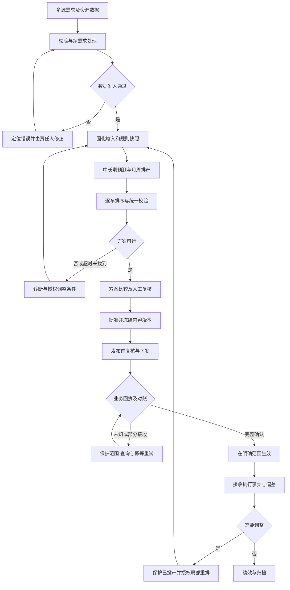
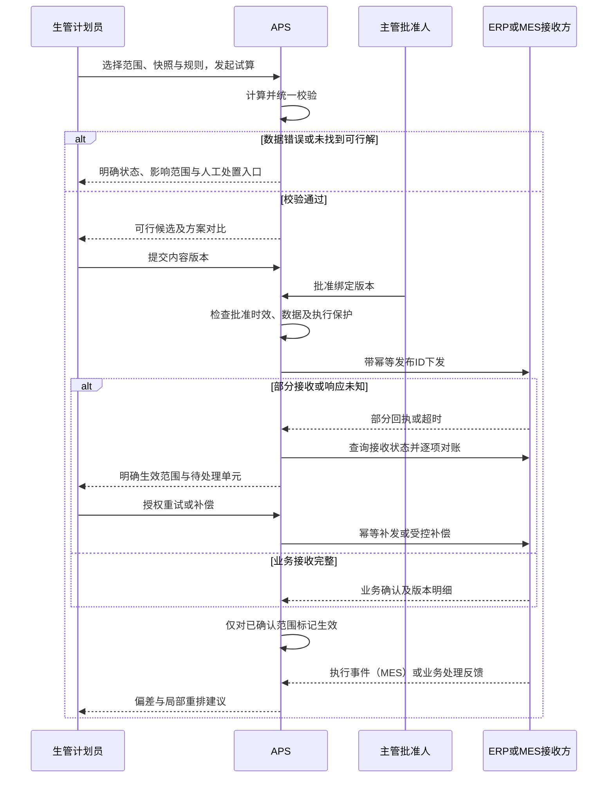

# 产品需求文档（PRD）V2.0

APS项目｜产品需求文档 V2.0（含一期实现状态标注）

---

## 需求基本信息

| 字段 | 内容 |
|------|------|
| 业务需求名称 | APS智能排产与计划协同平台 |
| 需求优先级 | 一期P0闭环；增强能力按范围评审确认 |
| 需求编号 | 待业务分配；文档功能编号FR-01至FR-14 |
| BRD评审 | 待完成 |
| PRD评审 | V2.0（在V1.1评审稿基础上升级，标注一期已实现能力与实现边界） |
| 实现基线 | 一期原型已按本PRD的W+3演示主线实现并通过页面级验收（见FR标注与附录A）；长期计划、ERP/MES实连及生产发布未实现 |
| 所属系统 | APS；对接ERP、MES及订单/供应信息来源 |
| 所属功能模块 | 数据与需求、长短期计划、排序校验、审批发布、执行异常、绩效 |
| 产品经理 | 待确认（不沿用模板项目责任人） |
| 预估人天 | 待范围、接口及规模确认后评估 |
| 原型入口 | 演示地址 `http://127.0.0.1:18746/?v=prod-operations-2#/plans`（本机演示服务，模拟身份、不接生产系统）；启动方式见《运行说明》 |

---

## 修订记录

| 版本 | 日期 | 修订人 | 审核人 | 修订说明 | 变更分类（产品/业务） |
|------|------|--------|--------|----------|----------------------|
| V1.0 | 2026-09-18 | AI辅助编制 | 待确认 | 建立痛点、价值、闭环、兜底和验收基线 | 产品 |
| V1.1 | 2026-09-18 | AI辅助编制 | 待确认 | 按指定PRD模板重排，增加字段、按钮、流程图、配置及原型映射；不代表业务口径已批准 | 产品 |
| V2.0 | 2026-09-19 | AI辅助编制 | 待确认 | 全文升版：以V1.1完整结构为基，标注FR-01至FR-14的一期实现状态；补充基础数据版本化引用、生产量级仿真估计、调度结果页面口径与统计结果不可提交约束；更新验收映射至实际完成的页面验收 | 产品 |

---

## 一、术语与缩写

| 术语/缩写 | 全称 | 定义说明 |
|-----------|------|----------|
| APS | Advanced Planning and Scheduling | 高级计划与排程，本项目为计划决策与协同平台 |
| ERP | Enterprise Resource Planning | 既有资源及物料业务系统，字段主责须确认 |
| MES | Manufacturing Execution System | 生产执行系统及执行事实来源 |
| N+3/N+6 | 中长期生产预测 | 业务命名沿用原需，起止月份与粒度待确认 |
| N+1 / W+3 | 月计划 / 周计划 | 日期范围按已确认业务日历，不从名称硬编码推导 |
| MTCO | 车型及配置代码 | 不等同订单或车辆实例，一个配置可对应多单多车 |
| 输入快照 | — | 本次计算引用的需求、供应、能力与规则版本集合 |
| 可行方案 | — | 满足有效硬约束并通过统一校验，不等于获批或生效 |
| 生效计划 | — | 在明确范围内完成批准和下游业务确认的计划 |
| 冻结 / 已下达 / 已投产 | — | 不同控制状态；已投产不能由APS当作草稿撤回 |
| 净需求 | — | 根据已确认冲销、结转和状态规则得到的待规划需求 |

---

## 二、背景与目标

### （一）描述/痛点

新能源汽车多车型、多配置混流生产，需要在销售需求、关键物料供应、工艺、产能和项目日程之间持续平衡。S1描述的现状是中长期预测依赖邮件与表格、周计划依赖人工、MES简单排序后仍需反复人工调整，计划多版本差异及变更风险不易识别。

本产品定位为“分层、滚动式计划决策与协同平台”。APS负责生成、校验、解释和管理计划；ERP及既有业务系统保留各自主数据和物料管理职责；MES保留生产执行与执行事实职责。

### （二）目标/价值

| 痛点ID | 已知痛点或闭环风险 | 目标价值 | 对应需求 | 验证方式 |
|---|---|---|---|---|
| P01 | 多源数据反复导入、合并、校对 | 减少整理工时与数据遗漏 | FR-01/02 | 同一历史样本下比较人工准备工时、漏项和重复项 |
| P02 | 多约束依赖经验，产能和物料未必充分利用 | 更快形成可执行且资源匹配的计划 | FR-03/04/05/06/07 | 硬约束合规；比较需求满足、切换损失和资源使用 |
| P03 | 需求和供应变化导致重排耗时 | 缩短异常响应，减少无谓扰动 | FR-08/12 | 从变更确认到方案生效的时间及改日/换序数量 |
| P04 | 多版本、跨层计划差异难辨识 | 提高决策透明度和计划一致性 | FR-05/09/13 | 版本差异、上下层数量核对及原因可追溯 |
| P05 | 发布、锁定、执行反馈规则未充分展开 | 避免错误版本、重复下发和重复排产 | FR-02/10/11/12 | 发布回执对账、投产保护、结转与重复消息测试 |
| P06 | 算法失败、数据不完整时无完整产品处置定义 | 不因自动化失败失去人工控制 | FR-01/08/14 | 错误数据、无解、超时、断连和人工接管演练 |

P01—P04主要来自S1；P05—P06是需求设计风险，不宣称已经发生生产事故。

#### 成功标准

一期成功必须同时满足：
1. 正式发布方案满足所有有效硬约束；无权限绕过校验。
2. 从输入快照到计算、人工调整、批准、发布回执和执行反馈可追溯。
3. 正常、缺料、插单、跨月、未完成结转和发布失败场景能够闭环。
4. 业务方认可的样本下，形成可审批方案的周期达到签署目标，且计划质量不低于约定人工基线。
5. 自动链路不可用时可进入受控人工流程，不发布未经验证的新方案。

耗时改善、产能改善和财务收益均需基线测量，不在本稿中承诺未经验证的百分比。

### （三）风险控制

以下为产品安全底线，不把“自动化成功”替代“业务确认”：

| 风险项 | 说明 | 应对 |
|--------|------|------|
| 历史参数直接上线 | 原说明书记录2021—2022年现状 | 当前规则和产能必须确认，示例数据不得视为生产参数 |
| 预测与实单重复 | 来源关系不明确 | 明确冲销才抵扣，未知范围阻断正式发布 |
| 错误方案获批 | 修改或供应变化使批准过期 | 批准绑定版本，发布前复核 |
| 部分发布与重试重复 | 技术送达不等于业务接受 | 发布单元、幂等、回执和逐项对账 |
| 未知执行状态重排 | MES断连不等于尚未投产 | 保护未知范围，人工确认后授权释放 |
| 算法未找到解 | 超时不等于证明无解 | 分开状态，保留受控人工入口，不绕硬约束 |

#### 范围与成功边界

#### 一期承诺范围（建议）

- 多来源需求导入、净需求计算、基础数据及约束治理。
- N+3/N+6、N+1、W+3及每日逐车排序，含人工调整。
- 跨层计划一致性、版本差异、可行性校验、风险提示。
- 审批、冻结、受控变更、ERP/MES发布回执及对账。
- 必要执行实绩、未完成结转、偏差分析及局部重排。
- 异常兜底、权限审计、任务运行状态与基础绩效。
- 数据模型保留工厂维度；多工厂独立运行及其他车间预测车序的实际交付深度，需按D-10锁定。

#### 2.3 非一期默认承诺

全工位实时监控、全厂高保真数字孪生、自动跨厂转产、自动采购、未经确认的自动交付承诺、机器学习独立预测市场销量。动态瓶颈与仿真作为增强能力，不阻断基本计划闭环。

原说明书已有多工厂兼容、其他车间预测车序方向。上述分期不等于删除原需求，必须通过范围评审明确“独立计划/预测”与“全局优化/执行指令”的边界。

---

## 三、整体流程

### （一）业务/功能流程图

### （二）交互时序图

### （三）状态、发布单元与变更控制

#### 4.1 正常闭环

需求接入 → 校验与净需求 → 确认有效数据/规则并生成快照 → 中长期/月份/周次分层计算 → 排序 → 独立于求解过程的统一可行性校验 → 方案比较 → 人工调整并复核 → 审批与冻结 → 按发布范围下发 → 业务回执确认与对账 → 执行反馈 → 偏差分析 → 授权局部重排或归档。

注意：统一校验使用同一规则口径，但不能仅信任算法自报“成功”。上下层不是单向拆分；排序无法满足约束时，允许创建回溯任务调整周计划，重新核对月计划。

#### 4.2 计划状态机

| 当前状态 | 动作/条件 | 下一状态 | 控制 |
|---|---|---|---|
| 草稿 | 数据齐全并完成计算/人工编制 | 待校验 | 记录快照与修改版本 |
| 待校验 | 校验通过 | 可提交 | 记录硬约束、软约束与时效结果 |
| 待校验 | 校验失败 | 草稿/阻断 | 返回明确原因，不可发布 |
| 可提交 | 计划员提交 | 待审批 | 冻结提交内容，避免审批中静默变更 |
| 待审批 | 驳回 | 草稿 | 保留意见与原提交记录 |
| 待审批 | 批准 | 已批准 | 批准绑定内容、快照和规则版本 |
| 已批准 | 校验仍有效且无已知关键数据冲突，发起下发 | 发布中 | 下发唯一发布标识 |
| 发布中 | 发布单元规定的接收方业务确认完成 | 已生效 | 生效范围明确，生成对账记录 |
| 发布中 | 超时/拒收/部分接收 | 发布异常 | 不整体标记生效；按第4.3节处理 |
| 已生效 | 新版本在同范围成功替代 | 已替代 | 旧版本仍可追溯，不能删除 |
| 已生效/已替代 | 周期结束并完成对账 | 已归档 | 保留基线、实绩、差异和异常处置 |

计算任务状态独立为：排队、运行、完成有可行解、到时有可行解、到时未找到可行解、已证明无解、失败、取消。取消计算不等于取消生效计划。

#### 4.3 发布单元与部分成功

【建议默认】按工厂、计划类型、时间范围和目标接收方定义可独立生效的发布单元。ERP预测发布与MES执行排序不是天然的分布式原子事务。

- 没有任何业务接收回执时，不宣称下游已采用新计划；原有效计划保留，但若原计划因缺料等已不可执行，明确告警，由执行负责人协调，不能默认继续执行。
- 部分单元已接收时，展示真实生效范围并锁定受影响范围；未接收部分不能自动假设使用新计划。
- 对已接收甚至已投产的内容，不做技术“回滚即撤销生产”的假设；需要受控取消/补偿版本并取得下游确认。
- 响应丢失但可能已接收时，先按发布标识查询/对账，再幂等重试，不生成新的重复指令。
- 审批后如收到影响可行性的关键新数据，发布前复核；需要变更则新建版本并重新批准。发布过程中到达的关键事件进入紧急变更流程。

#### 4.4 变更闭环

事件登记 → 核实数据 → 识别订单、时间与资源影响 → 划定已投产/已下达/冻结/可调整范围 → 生成局部方案 → 比较交付与扰动 → 必要跨部门确认 → 变更批准 → 下发与回执 → 执行观察 → 关闭事件。

没有影响或不需要重排的事件，也需记录判断依据；多个同源事件可合并，但保留原始记录，防止重复触发。

---

## 四、功能性需求

### （一）正常业务场景

以下字段是产品逻辑字段，不宣称为已确定的API字段。字段类型、命名和接口映射须在数据契约中确认。“新增”相对本次APS产品设计，不表示已核实ERP/MES字段现状。

原型用于评审主要交互，未覆盖的字段或页面不意味着需求被删除；模拟角色切换不等于生产鉴权。

#### A 功能：FR-01 数据接入、校验与快照【原需＋补齐｜P0】

〈实现状态〉

**一期实现状态：部分实现。** 场景XML接口实例载入、输入快照固化、质量检查与阻断提示已实现并通过页面验收；ERP/MES实连、受控模板导入、错误行隔离区未实现。

〈原型设计〉

演示环境已按本功能开放对应页面（见附录A操作映射）；完整生产规则以本需求为准。

〈字段及逻辑〉

| 字段名 | 字段类型 | 是否必填 | 变更标记 | 说明 |
|--------|----------|----------|----------|------|

| importBatchId | String | 是 | 新增 | 导入批次唯一标识 |
| sourceVersion | String | 是 | 新增 | 来源数据版本 |
| snapshotId | String | 计算时必填 | 新增 | 不可变输入快照 |
| qualityStatus | Enum | 是 | 新增 | 待校验/合格/阻断 |

〈按钮逻辑〉

导入预检：展示逐行错误，不直接生效；确认接收：有权限且阻断已清除；生成快照：冻结本次有效输入。

〈功能描述〉

**痛点/价值**：P01/P06；避免“垃圾数据进、错误计划出”，减少手工核对。

- 输入：订单、车型配置映射、节拍日历、供应、项目日程、历史实绩；API或受控模板导入，具体系统按数据契约确认。
- 处理：校验字段、单位、主键、数量范围、引用关系、生效日期及来源版本；导入先预检再确认。错误行进入隔离区，不能静默跳过导致需求缩水。
- 默认整批拒绝关键结构错误；允许部分接收时必须由业务确认，并显示接收/拒绝数量与未纳入排产影响。
- 输出：导入批次、错误清单、责任人、可用数据版本；计算前固化输入快照。
- 兜底：关键数据缺失/过期时阻断正式发布；是否允许用有标识的历史快照进行试算由权限控制，试算不能直接生效。
- 验收：AC-01；与FR-10共同校验批准后数据变化。

#### B 功能：FR-02 需求与订单生命周期【原需＋补齐｜P0】

〈实现状态〉

**一期实现状态：核心实现。** 预测桶冲销、取消未开工剔除、净需求与订单生命周期已在演示链路实现；跨来源业务映射、结转全量规则未实现。

〈原型设计〉

演示环境已按本功能开放对应页面（见附录A操作映射）；完整生产规则以本需求为准。

〈字段及逻辑〉

| 字段名 | 字段类型 | 是否必填 | 变更标记 | 说明 |
|--------|----------|----------|----------|------|

| orderId | String | 是 | 新增 | 统一订单标识，保留来源映射 |
| quantity | Integer | 是 | 新增 | 非负整数量，取消采用状态变更 |
| forecastBucket | Object | 冲销时必填 | 新增 | 期间、工厂、配置及关联规则 |
| orderStatus | Enum | 是 | 新增 | 待排/已下达/已投产/完工/取消 |

〈按钮逻辑〉

搜索/筛选：仅改变展示；确认冲销：需关联规则明确；取消/修改：显示受影响的已排或已投产部分并分流处置。

〈功能描述〉

**痛点/价值**：P01/P05；防止预测与实单重复、漏排和重复结转。

- 输入：订单业务ID、来源版本、数量、配置、需求日期/承诺日期、优先级、状态及预测桶。
- 规则：建立来源ID到APS统一ID的映射；同版本重复输入幂等，高版本修改保留历史，低版本不得覆盖；跨来源是否同单依赖业务映射，不能仅凭配置和数量去重。
- 预测冲销按工厂、期间、配置层级、订单类别及匹配规则执行，保留冲销明细。示例：预测100、确认属于该预测桶的实单60、没有其他消耗时，剩余预测40，总待考虑需求100；未确认属于同桶不能自动抵扣。
- 已完工排除，已投产保护，未完成按原订单ID结转而非复制新需求。取消仅释放尚可取消部分；已投产部分转异常协调。
- 输出：净需求池、未匹配项、取消/修改影响、冲销和结转链路。
- 兜底：冲销关系不明时标记待确认并阻断相关范围正式发布；不默认为预测加实单，也不任意抵扣。
- 验收：AC-02/03。

#### C 功能：FR-03 资源、供应与约束中心【原需＋补齐｜P0】

〈实现状态〉

**一期实现状态：核心实现（演示口径）。** 产线/节拍/班次日历/工序缓冲/切换规则的版本化维护、缺项阻断与计划显式引用新版本已实现；有效产能多口径扣减、物料可用性细分、替代关系管理未实现。

〈原型设计〉

演示环境已实现基础数据维护页面（工艺负责人身份）；完整生产规则以本需求为准。

〈字段及逻辑〉

| 字段名 | 字段类型 | 是否必填 | 变更标记 | 说明 |
|--------|----------|----------|----------|------|

| ruleId / version | String | 是 | 新增 | 规则标识与不可覆盖版本 |
| constraintType | Enum | 是 | 新增 | 硬约束或软约束 |
| effectiveRange | Object | 是 | 新增 | 工厂、车型、有效日期 |
| availableQuantity | Number | 适用时必填 | 新增 | 依批准口径计算可用量 |

〈按钮逻辑〉

新建规则版本：保留旧版；提交批准：校验冲突和适用期；硬约束不提供直接关闭按钮。

〈功能描述〉

**痛点/价值**：P02；建立可维护、可追溯的可执行性边界。

- 维护工厂、车间/产线、日历、班次、停线、节拍、有效产能、车型资格、关键物料、项目日程和工艺规则。
- 物料必须区分可用库存、已占用、冻结、在途和承诺可用时间；如何换算为可排产量由确认后的规则执行，不以账面库存直接替代。
- 替代动总/物料须有已批准适用关系及生效日期，不因名称相近自动替代。
- 有效产能扣减口径唯一，避免开动率、检修停线与切换损失重复扣减；聚合计划与排序时间核算的口径需可对账。
- 规则包含硬/软类型、参数及单位、适用范围、优先级、生效期、来源、负责人和批准记录。目标采用“先硬约束、再业务优先级”的分层评价，权重变动展示影响。
- 输出：版本化资源/约束集、有效性校验、变更影响的计划清单。
- 兜底：冲突规则不得静默覆盖；规则更改只影响规定范围，历史计划仍引用旧版。
- 验收：AC-04/05。

#### D 功能：FR-04 N+3/N+6生产预测【原需｜P0】

〈实现状态〉

**一期实现状态：未实现。** 长期预测引擎未开放；仅保留计划类型边界说明，不提供假入口。

〈原型设计〉

演示环境已按本功能开放对应页面（见附录A操作映射）；完整生产规则以本需求为准。

〈字段及逻辑〉

| 字段名 | 字段类型 | 是否必填 | 变更标记 | 说明 |
|--------|----------|----------|----------|------|

| horizon | Enum | 是 | 新增 | N+3或N+6，起止由日历配置 |
| forecastQuantity | Integer | 是 | 新增 | 聚合或配置级数量 |
| supplyGap | Integer | 是 | 新增 | 未满足量，不隐藏缺口 |
| baselineVersion | String | 对比时必填 | 新增 | 比较版本 |

〈按钮逻辑〉

生成预测：校验数据后建任务；对比版本：显示结构和数量差；提交：需明确缺口及对外信号属性。

〈功能描述〉

**痛点/价值**：P01/P02/P04；减少预测表操作，支持中长期供需平衡。

- 输入：销售预测、历史实绩、关键供应、新车爬坡/旧车打切、有效产能与业务策略。
- 处理：检查重合月份一致性、总量与结构变化、停产后需求、新车日程；按批准策略分配动总并形成聚合生产预测，支持人工修订。
- 输出：N+3配置粒度和N+6聚合粒度的预测、供需缺口、相对销售/历史版本/实绩的差异；具体MT/MTCO表示方式见D-01。
- 不将本模块定义为独立市场销量预测；供应不足可形成带缺口的分析草案，缺口不得隐藏为全部已满足。
- 兜底：信息不完整时仅输出有标识试算；经批准的对外预测需明确哪些数量是规划意图、哪些有供应支撑，不能直接变成执行指令。
- 验收：AC-06。

#### E 功能：FR-05 N+1月计划与跨层一致性【原需＋补齐｜P0】

〈实现状态〉

**一期实现状态：未实现。** N+1月计划引擎未开放。

〈原型设计〉

演示环境已按本功能开放对应页面（见附录A操作映射）；完整生产规则以本需求为准。

〈字段及逻辑〉

| 字段名 | 字段类型 | 是否必填 | 变更标记 | 说明 |
|--------|----------|----------|----------|------|

| planMonth | Month | 是 | 新增 | 自然月及业务时区 |
| dailyQuantity | Integer | 是 | 新增 | 按日及车型分配 |
| lockedRange | Object | 是 | 新增 | 已执行、已锁定和可调整范围 |
| unmetQuantity | Integer | 是 | 新增 | 需求未满足量 |

〈按钮逻辑〉

滚动更新：新建版本而非覆盖；申请班次调整：进入批准流程；查看跨月明细：按实际日期核对。

〈功能描述〉

**痛点/价值**：P02/P04；将月度需求转为可行的日分配，并保持滚动一致。

- 输入：净需求、月预测、日历产能、关键物料、项目日程、已锁定周计划及执行情况。
- 处理：保护已执行和已锁定范围，对剩余期间预排；按车辆/订单归属日期拆分跨月周，不能整周重复记入两个自然月。
- 输出：日数量、车型/动总等汇总、出勤建议、缺口与版本差异。
- 月总需求与已完成、已锁定、未锁定预排及未满足量须在同一口径下核对；未满足不能自动消失。原计划数量、需求目标、调整后承诺应分字段展示。
- 周计划变化后生成待确认月计划新版本，不静默覆盖已发布版本；如需调整冻结范围，进入变更流程。
- 兜底：产能不足时提出缺口和可审批班次建议，不自动安排未批准加班。
- 验收：AC-07/08。

#### F 功能：FR-06 W+3周计划【原需｜P0】

〈实现状态〉

**一期实现状态：核心实现（演示口径）。** W+3订单分配、未排清单与原因、供应占用建议已实现；与月计划跨层联动未实现。

〈原型设计〉

演示环境已按本功能开放对应页面（见附录A操作映射）；完整生产规则以本需求为准。

〈字段及逻辑〉

| 字段名 | 字段类型 | 是否必填 | 变更标记 | 说明 |
|--------|----------|----------|----------|------|

| targetWeek | DateRange | 是 | 新增 | 按已确认业务日历 |
| orderDayAssignments | List | 是 | 新增 | 订单与日期对应，不重复分配 |
| materialAllocation | List | 是 | 新增 | 计划占用建议，不冒充ERP实占 |
| unscheduledOrders | List | 是 | 新增 | 未排订单与原因 |

〈按钮逻辑〉

生成周计划：只使用当前快照；进入排序：传递订单集合；未排明细：显示原因和责任处理入口。

〈功能描述〉

**痛点/价值**：P02；确定每天具体订单，同时兼顾后续可排序性。

- 输入：净需求、月计划日能力、关键供应、项目日程、优先级、固定订单和基础排序限制。
- 处理：分配订单到日，保留来源和车辆实例标识；同时预检受限配置每日上限、批量和间隔等可聚合条件。
- 输出：订单级日计划、需求满足/未满足清单、供应占用建议和排序输入集合。APS内的计划占用不默认等同ERP实际预留，需接口确认。
- 兜底：日排序失败时反馈相关日期与约束，创建周计划调整方案；不得强行发布不可排序的周计划为最终执行计划。
- 验收：AC-09；与AC-10联测。

#### G 功能：FR-07 日排序与车间预测车序【原需｜P0，扩展深度待确认】

〈实现状态〉

**一期实现状态：核心实现（演示口径）。** 焊装上线顺序、各工序起止时间、约束校验与四策略比较已实现；人工拖动调整、下游MES车序映射未实现。

〈原型设计〉

演示环境已按本功能开放对应页面（见附录A操作映射）；完整生产规则以本需求为准。

〈字段及逻辑〉

| 字段名 | 字段类型 | 是否必填 | 变更标记 | 说明 |
|--------|----------|----------|----------|------|

| vehicleInstanceId | String | 是 | 新增 | APS车辆实例，关联订单 |
| sequenceNo | Integer | 是 | 新增 | 范围内唯一序位 |
| fixedRelativeOrder | Boolean | 是 | 新增 | 是否保护相对顺序 |
| downstreamSequenceType | Enum | 适用时必填 | 新增 | 预测或经确认执行，不混用 |

〈按钮逻辑〉

移动/交换：仅可调整区；校验：包含班次及跨日边界；提交审批：校验通过且版本未变化。

〈功能描述〉

**痛点/价值**：P02；快速形成满足工艺的车序，减少切换和人工反复调整。

- 输入：周计划车辆实例集合、有效工艺约束、固定顺序/区间、班次和边界状态。
- 处理：批次、比例、颜色、间隔、车型/地板/顶棚切换及特殊车规则；校验班次和跨日连接处，不能只校验每天内部。
- 输出：焊装上线顺序、批次/切换信息、约束明细及软目标评价；需要映射MES车辆标识时保留映射关系，不默认由APS生成VIN。
- 总装与焊装顺序不同；其他车间车序必须标识“预测”及假设。缺少缓存与流转规则时不将推算车序当成执行承诺。
- 兜底：不擅自改变车辆集合、已锁定相对顺序或物料限制；需要改日时回到FR-06并授权。
- 验收：AC-10/11。

#### H 功能：FR-08 求解任务、统一校验与失败兜底【原需＋补齐｜P0】

〈实现状态〉

**一期实现状态：核心实现。** 后台任务、时限与取消、任务状态区分、统一校验、失败原因透出已实现；分层混合求解的可配置时限签署、诊断最小冲突集未实现。另有生产量级蒙特卡洛统计链路（统计结果不可提交审批）。

〈原型设计〉

演示环境已按本功能开放对应页面（见附录A操作映射）；完整生产规则以本需求为准。

〈字段及逻辑〉

| 字段名 | 字段类型 | 是否必填 | 变更标记 | 说明 |
|--------|----------|----------|----------|------|

| taskId | String | 是 | 新增 | 求解任务标识 |
| timeLimit | Number | 是 | 新增 | 按已签署性能要求配置 |
| taskStatus | Enum | 是 | 新增 | 运行/可行/超时未找到/无解/失败等 |
| validationReport | Object | 提交时必填 | 新增 | 统一校验及规则版本 |

〈按钮逻辑〉

开始计算：固定输入及规则；取消：停止任务不取消生效计划；重试：保留失败记录，新任务关联原任务。

〈功能描述〉

**痛点/价值**：P02/P03/P06；有限时间内给出可靠结果，失败也能操作。

- 支持任务排队、运行、取消、时限和方案保存；记录输入、规则、算法配置与运行标识。
- 采用分层混合求解，允许规则启发式、限时优化与局部修复；产品不限定单一算法，不要求证明全局最优。
- 算法输出必须经过统一校验。到时有可行解可进入候选但不自动批准；到时未找到可行解不得描述为已证明无解。
- 诊断至少给出已识别阻断条件、影响范围和候选处置。无法严格定位最小冲突集时明确诊断不完备，不伪造数学证明。
- 人工编辑同样受校验；规则服务不可用时可保存草稿，但禁止新的正式发布。
- 兜底：保留上一生效版本与其有效性警告，支持受控人工编制/模板流程；算法失败不能绕过审批与回执。
- 验收：AC-12/13。

#### I 功能：FR-09 人工调整与方案对比【原需＋补齐｜P0】

〈实现状态〉

**一期实现状态：部分实现。** 方案对比（多候选指标比较）已实现；人工拖动调整、并发编辑版本锁、固定对象未实现。

〈原型设计〉

演示环境已按本功能开放对应页面（见附录A操作映射）；完整生产规则以本需求为准。

〈字段及逻辑〉

| 字段名 | 字段类型 | 是否必填 | 变更标记 | 说明 |
|--------|----------|----------|----------|------|

| contentVersion | String | 是 | 新增 | 并发编辑版本锁 |
| changeReason | String | 提交修改时必填 | 新增 | 业务调整原因 |
| fixedItems | List | 否 | 新增 | 人工固定对象 |
| comparisonBaseline | String | 比较时必填 | 新增 | 标明快照差异 |

〈按钮逻辑〉

保存修改：检查并发版本；撤销：回到本草稿上一步；对比方案：展示取舍；重新校验：修改后必须执行。

〈功能描述〉

**痛点/价值**：P03/P04；可解释取舍，保留业务人员控制权。

- 支持数量修改、改日、序列移动/交换、固定对象和撤销；草稿可短暂存在违规但必须明显标记，不可提交发布。
- 提交修改采用内容版本校验；多人并发冲突提示重新加载/合并，不采用最后写入覆盖。
- 比较需求满足、交付影响、切换、软约束、数量变更、改日和换序；跨不同输入快照比较时标记差异来源。
- 人工固定项参与后续求解；与硬约束冲突时说明冲突，不静默解除。
- 输出：可复核方案、修改记录、调整原因和比较报告。
- 兜底：新方案失效不覆盖已生效方案；可回到历史草稿另存，但重新校验后才能发布。
- 验收：AC-14/15。

#### J 功能：FR-10 审批、冻结与授权变更【原需＋补齐｜P0】

〈实现状态〉

**一期实现状态：核心实现（演示口径）。** 提交绑定候选、批准绑定内容、批准后锁定（禁止重算/换场景/换候选）已实现；冻结区细分、解冻授权流程未实现。

〈原型设计〉

演示环境已实现演示级提交/批准页面；生产发布相关能力未实现，完整规则以本需求为准。

〈字段及逻辑〉

| 字段名 | 字段类型 | 是否必填 | 变更标记 | 说明 |
|--------|----------|----------|----------|------|

| approvalId | String | 批准后必填 | 新增 | 审批记录 |
| approvedContentVersion | String | 是 | 新增 | 绑定具体内容版本 |
| freezeScope | Object | 是 | 新增 | 冻结范围 |
| changeAuthorization | Object | 解冻时必填 | 新增 | 原因、范围、批准者 |

〈按钮逻辑〉

批准/驳回：仅批准角色且针对提交版本；申请解冻：必须写原因；已投产对象不提供重新排序入口。

〈功能描述〉

**痛点/价值**：P05；防止错误内容获批、冻结失效和越权改动。

- 批准绑定方案内容版本、输入快照、规则版本和校验结果；任何影响计划内容的修改使既有批准失效。
- 区分软冻结、已下达和已投产保护；准确术语与可变范围按D-06确认。默认已投产不可由APS重新排序或撤回。
- 解冻需申请人、原因、影响、批准人及范围；不能一次批准永久解除保护。
- 关键新数据到达时标记批准可能过期，发布前复核其影响；无影响判定也需记录。
- 兜底：批准人不在岗采用已配置代理审批；无合法代理则保持待审批，禁止运维代批。
- 验收：AC-16/17。

#### K 功能：FR-11 发布、回执与集成对账【原需＋补齐｜P0】

〈实现状态〉

**一期实现状态：未实现。** ERP/MES发布、幂等回执与对账未实现；演示批准仅记录本机状态。

〈原型设计〉

演示环境已实现演示级提交/批准页面；生产发布相关能力未实现，完整规则以本需求为准。

〈字段及逻辑〉

| 字段名 | 字段类型 | 是否必填 | 变更标记 | 说明 |
|--------|----------|----------|----------|------|

| publishId | String | 是 | 新增 | 幂等发布唯一标识 |
| publishScope | Object | 是 | 新增 | 工厂、时间、目标、记录摘要 |
| businessReceipt | Enum | 是 | 新增 | 未发/处理中/部分接受/拒绝/接受/未知 |
| reconciliationEvidence | Object | 确认时必填 | 新增 | 版本、数量、顺序核对证据 |

〈按钮逻辑〉

发布：批准有效且复核通过；查询回执：不盲目重发；对账重试：使用原幂等标识；人工确认：必须上传/登记证据。

〈功能描述〉

**痛点/价值**：P05；避免重复、部分成功和版本不一致。

- 下发包含发布ID、计划ID/版本、工厂、日期范围、记录数及校验摘要、操作类型和引用的前版。
- 按第4.3节定义发布单元；分开呈现技术送达、业务接受、业务拒绝、处理中和未知状态。
- 重复消息按同一发布ID幂等；接口超时先查询状态再重试；人工导入也必须登记发布ID与证据。
- 对账至少校验版本、范围、订单/车辆标识、数量及执行顺序（如适用），不能只核对总量。
- 输出：生效范围、回执明细、差异与处置任务。
- 兜底：下游不能提供API回执时，采用授权人工确认并附下游导入记录/对账证据，界面明确非自动确认，不将文件导出视为接收。
- 验收：AC-18/19/20。

#### L 功能：FR-12 执行反馈、结转与局部重排【补齐｜P0】

〈实现状态〉

**一期实现状态：未实现。** 执行反馈集成与局部重排未实现；来源事件仅展示，动态插单/撤单不生效（边界已声明）。

〈原型设计〉

演示环境已按本功能开放对应页面（见附录A操作映射）；完整生产规则以本需求为准。

〈字段及逻辑〉

| 字段名 | 字段类型 | 是否必填 | 变更标记 | 说明 |
|--------|----------|----------|----------|------|

| eventId | String | 是 | 新增 | 事件去重标识 |
| occurredAt / receivedAt | DateTime | 是 | 新增 | 发生时间与接收时间 |
| executionStatus | Enum | 是 | 新增 | 保留单调演进与冲突处理 |
| impactScope | Object | 重排时必填 | 新增 | 对象、日期及资源范围 |

〈按钮逻辑〉

确认影响：保留判断；创建局部重排：限定授权范围并另建草稿；关闭异常：必须有生效或无需调整证据。

〈功能描述〉

**痛点/价值**：P03/P05；让计划依据真实进度滚动，不重复生产。

- 输入：订单/车辆状态、投产/完工时间、未完成、关键停线和供应变化，按最小必要字段集成。
- 去重并处理乱序；晚到历史状态不能覆盖更晚已完成状态；无法排序的冲突进入人工核对。
- 比较指定生效基线，识别偏差和影响范围；延迟反馈显示数据时间戳和可信度。
- 重排只调整授权范围，保护已投产及固定相对顺序；更大范围变更需重新批准。
- 事件包括负责人、处理时限、处置方案、批准及结果；关闭需确认计划已生效或记录无需调整依据。
- 兜底：MES断连时不假设未反馈订单尚未投产；对执行状态未知范围阻断可能冲突的重排/下发，由执行负责人确认后释放。
- 验收：AC-03/21/22。

#### M 功能：FR-13 报表、绩效与价值验证【原需＋补齐｜P0】

〈实现状态〉

**一期实现状态：部分实现。** 调度结果指标对比、完成率/按期率/准时率/拖期口径已实现并标注统计估计；基线达成率、价值指标报表未实现。

〈原型设计〉

演示环境以“调度结果”区块承载本功能演示口径；完整生产规则以本需求为准。

〈字段及逻辑〉

| 字段名 | 字段类型 | 是否必填 | 变更标记 | 说明 |
|--------|----------|----------|----------|------|

| metricCode | String | 是 | 新增 | 指标编码 |
| baselinePlanVersion | String | 是 | 新增 | 事前固定版本 |
| dataCompleteness | Enum | 是 | 新增 | 完整/部分/不可计算 |
| metricValue | Number | 可计算时必填 | 新增 | 未知不写0 |

〈按钮逻辑〉

切换基线：明确标识统计变化；查看明细：可追溯订单；导出：同筛选同版本并记录审计。

〈功能描述〉

**痛点/价值**：P04；让收益和风险可解释、可核验。

- 提供需求/预测/计划版本对比、供需缺口、约束满足、计划达成、切换及调整影响报表。
- 展示数据范围、基线版本、更新时间和计算口径；导出与页面同一筛选和版本。
- 计划编制周期与纯求解时间分开统计；达成率按事前固定的生效计划统计，不用事后重排抹掉未完成。
- 输出指标明细可追溯至订单/车辆/计划/事件；产能与库存改善不能全部归因于APS，需标注外部影响。
- 兜底：实绩缺失时标记“不可计算/部分数据”，不能以零值代替真实绩效。
- 验收：AC-23。

#### N 功能：FR-14 权限、审计与运行保障【补齐｜P0】

〈实现状态〉

**一期实现状态：核心实现（演示口径）。** 角色与工厂服务端隔离、操作审计、任务失败原因透出、服务重启中断恢复已实现；生产鉴权、告警分派闭环未实现。

〈原型设计〉

演示环境已实现角色隔离与操作审计；完整维护/权限管理页面未绘制。

〈字段及逻辑〉

| 字段名 | 字段类型 | 是否必填 | 变更标记 | 说明 |
|--------|----------|----------|----------|------|

| actor / role | String | 是 | 新增 | 真实身份及业务角色 |
| factoryScope | List | 是 | 新增 | 可访问工厂范围 |
| auditAction | Enum | 是 | 新增 | 动作及前后版本 |
| incidentStatus | Enum | 是 | 新增 | 待确认/处理/恢复/关闭 |

〈按钮逻辑〉

确认告警：分派责任人；恢复：技术恢复不等于业务关闭；恢复自动发布：须完成执行对账与授权。

〈功能描述〉

**痛点/价值**：P05/P06；保证多人协同、故障恢复和人工接管受控。

- 按角色、工厂、业务对象和操作授权；服务端校验，不能只隐藏按钮。
- 审计导入、规则修改、人工调整、批准、解冻、发布、重试、导出及人工确认，包含操作者、时间、前后版本和原因。
- 任务及接口失败形成可分派告警；明确确认、处理中、已恢复、已关闭状态；技术恢复不自动关闭业务影响。
- 兜底：故障时可使用可读取的已批准计划，或从受控备份取得已确认的可执行范围和必要校验信息；离线人工处置需执行负责人记录，并在恢复后先对账再恢复自动发布。
- 不因服务恢复自动重放所有发布；先核对下游实际接收和执行范围。
- 验收：AC-24/25。

#### 边界场景

| 边界项 | 系统行为 |
|--------|----------|
| 同配置不同订单 | 不按配置简单去重，保留业务ID |
| 跨月周 | 按日期归属，不重复计入月总量 |
| 算法超时有可行解 | 校验后可作为候选，不自动批准 |
| 算法超时无解返回 | 标记未找到，不冒充证明无解 |
| 已投产或状态未知 | 禁止冲突重排，未知须执行方确认 |
| 人工修改 | 可保存违规草稿，不可违规提交发布 |
| 零分母或实绩缺失 | 不可计算/不适用，不写成0%或100% |
| 导出或网络送达成功 | 仍需业务接受，不直接生效 |

#### 输入/输出规则

#### 6.1 最小业务对象

| 对象 | 最小关键字段/关系 |
|---|---|
| 需求/订单 | 统一ID、来源ID及版本、工厂、配置、数量、日期、优先级、状态、预测桶及冲销关系 |
| 车辆实例 | APS实例ID、订单ID、MTCO、MES/VIN映射（如已生成）、计划日期、序位、执行状态 |
| 资源日历 | 工厂/车间/产线、日期/班次、可用时间、有效能力、停线、能力版本 |
| 供应记录 | 物料、工厂/供应地、状态、数量、可用时间、承诺版本、来源、更新时刻 |
| 约束/目标 | 规则ID、硬软类型、参数及单位、适用范围、生效期、版本、批准人与优先级 |
| 输入快照 | 快照ID、各输入版本清单、采集时间、质量报告、适用范围 |
| 计划/方案 | 计划ID、层级、期间、工厂、内容版本、父层版本、快照、规则、任务、状态 |
| 发布单元 | 发布ID、目标、范围、计划版本、记录摘要、幂等键、接收状态、回执证据 |
| 执行事件 | 事件ID、来源版本/序号、发生和接收时间、对象ID、前后状态、冲突标志 |
| 异常/变更 | 原因、影响范围、责任人、时限、授权、处置方案及关闭依据 |

时间必须保留业务时区与事件发生时间；车辆计数采用整数及守恒校验；跨日/跨月归属规则必须明确。订单和车辆状态不得仅靠自由文本维护。

#### 6.2 接口逻辑清单

| 接口 | 方向 | 内容 | 必须约定 |
|---|---|---|---|
| IF-01 | 销售/订单来源→APS | 预测、订单、新增修改取消 | 业务ID、版本、冲销关联、变更语义 |
| IF-02 | ERP/主数据来源→APS | 零件、配置、拆解等 | 权威来源、生效期、全量/增量及删除语义 |
| IF-03 | 采购物流/供应来源→APS | 库存、到货、承诺供应 | 库存状态、占用范围、可用时间与更新周期 |
| IF-04 | APS→ERP | 批准的预测/相关计划 | 规划信号属性、接收版本、撤销或替代语义 |
| IF-05 | APS→MES | 批准的生产排序 | 发布单元、序位、车辆ID映射、业务回执 |
| IF-06 | MES→APS | 投产、完工、未完成及必要异常 | 顺序/版本、幂等、延迟与补数机制 |
| IF-07 | 接收方→APS | 接收结果及对账 | 技术/业务状态、部分接收、查询与重试 |

不预设所有系统均有API。每项接口必须在联调前签署字段、责任人、刷新频率、最大允许延迟、错误码与恢复方式；无API时采用受控文件或人工回执，但不降低核对标准。

### （二）异常业务场景

| 异常场景 | 触发条件 | 处理方式 | 用户提示文案 |
|----------|----------|----------|--------------|
| 数据不合格 | 缺字段、过期、关系不明 | 阻断相关正式发布，定位责任方 | “数据未达到排产准入要求，请先处理阻断项。” |
| 硬约束违反 | 人工或算法产生违规 | 保留草稿，禁止提交 | “存在硬约束冲突，不能提交审批。” |
| 到时未找到解 | 时限结束无可行候选 | 区分无解证明，允许修改条件或人工编制 | “时限内未找到可行方案，不代表当前问题无解。” |
| 批准失效 | 获批后修改或关键条件变化 | 复核并重新批准 | “本版批准已不适用，请重新校验并提交。” |
| 回执未知 | 超时或响应丢失 | 查询对账，不生成重复指令 | “尚未确认下游接受状态，请先对账。” |
| 部分接收 | 部分单元成功 | 明确生效范围，受控补发/补偿 | “仅部分单元已接收，整版计划尚未完整生效。” |
| 执行断连 | 实绩超过允许延迟 | 保护未知执行范围 | “执行状态待确认，该范围暂不可重排。” |
| 角色无权限 | 越权批准或发布 | 服务端拒绝并审计 | “当前角色无权执行此操作。” |

#### 异常责任与恢复闭环

| 异常 | 系统动作 | 人工责任 | 恢复/关闭条件 |
|---|---|---|---|
| 输入缺失/过期 | 阻断相关发布，定位来源和对象 | 数据责任人补齐 | 新版本准入通过并重新校验 |
| 供应不足/工艺冲突 | 显示未满足及影响，生成处置候选 | 生管协调销售、供应、工艺 | 条件获批变更或确认未满足处理方案 |
| 超时未找到方案 | 明确未找到而非无解，保留任务与快照 | 计划员调整范围或人工编制 | 方案校验、批准、回执完成 |
| 人工修改违规 | 阻止提交，定位对象与规则 | 计划员修正/申请业务条件变更 | 统一校验通过 |
| 审批人缺席 | 使用已授权代理，否则保持待审批 | 生管主管 | 合法批准完成 |
| 发布超时/未知 | 查询、对账后幂等重试 | 系统与接收方负责人 | 明确业务接收范围，无重复 |
| 部分发布成功 | 冻结受影响范围，拆分显示状态 | 生管与MES/ERP负责人 | 补发或受控补偿完成并对账 |
| 执行反馈中断 | 标记过期，保护未知执行区 | 执行负责人确认现场事实 | 补数对账后解除保护 |
| 系统不可用 | 使用已确认有效计划和受控人工记录；失效计划另行协调 | 业务值守与运维 | 恢复、对账、批准后恢复自动链路 |
| 紧急现场调整 | 登记人工指令与实际变化，不冒充原方案 | 执行与生管负责人 | 回填事实，重建后续基线并追溯 |

---

## 五、角色权限

| 角色 | 功能/页面 | 权限范围 | 数据范围 | 备注 |
|------|-----------|----------|----------|------|
| 生管计划员 | 需求、计划、排序 | 编制、校验、调整、提交 | 授权工厂和计划 | 不直接解除硬约束 |
| 生管主管 | 审批发布 | 批准、授权解冻、重大变更 | 授权范围 | 编制和批准职责分离 |
| 销售协调人 | 需求与交付影响 | 提交修正需求、确认影响 | 授权需求 | 不修改生效生产计划 |
| 采购物流 | 供应与缺料 | 确认供应、到货与可用性 | 授权资源 | 不擅自替代工艺关系 |
| 工艺/产能负责人 | 规则与资源 | 维护提交有效规则 | 授权工厂产线 | 规则版本须批准 |
| 执行协调人 | 发布和执行异常 | 确认接收、现场状态和异常 | 授权执行范围 | 不覆盖既成事实 |
| 管理/审计者 | 报表与追溯 | 只读及授权导出 | 授权数据 | 导出可审计 |
| 运维管理员 | 接口、任务、账号 | 技术恢复、运行保障 | 技术授权范围 | 不默认拥有业务批准权 |

---

## 六、非功能性需求

### （一）用户与业务规模

按D-02确认工厂、产线、日车辆数量、规划周期、并发用户。未签署规模前不承诺固定耗时。

### （二）性能指标要求

按层级签署首次可行解、最终结果时限、并发和取消响应。超时必须有明确状态与兜底；见D-08及压测要求。

### （三）安全要求

按角色和工厂隔离，服务端校验，记录批准、解冻、发布和导出；原型模拟身份不可用于生产鉴权。

### （四）高可用要求

保留计划和发布状态，支持备份恢复与人工接管；RTO/RPO及服务时段见D-11。恢复后先对账，不盲目重放发布。

### （五）监控告警要求

监控计算失败、接口超时、回执未知、数据过期、执行断连及未关闭异常。告警具有责任人、确认、处理、恢复、关闭状态；技术恢复不自动关闭业务影响。

#### 非功能验收明细

| 领域 | 要求 | 验证 |
|---|---|---|
| 计算性能 | 任务必须有时限、状态和取消能力；中长期/月/周/日分别定义时限和样本规模 | 压测记录数据规模、约束数、硬件、并发、首次可行解及最终质量，不脱离规模承诺秒数 |
| 可用性 | 关键故障可告警，已生效数据可读取或有受控备份；发布状态不能因重启丢失 | 服务中断、重启、任务恢复及接口重试演练 |
| 一致性 | 幂等、版本冲突检查、输入快照不可变；发布与执行保护优先于可用性 | 重复、乱序、并发、网络超时用例 |
| 安全 | 最小权限、工厂隔离、审计；敏感订单信息按需展示与导出 | 越权访问、直接接口调用、跨厂导出测试 |
| 可恢复 | 明确备份、恢复点目标和恢复时间目标，按D-11签署 | 恢复后验证版本、回执、审计及执行状态一致性 |
| 可维护 | 规则可配置但有版本和批准；算法或规则升级可用历史样本回归 | 升级前后可行性、质量、时限对比，失败回退软件而非回滚生产事实 |
| 可解释 | 显示硬约束结果、软目标代价、关键数据缺口与人工修改 | 计划员可定位订单/日期/规则，不仅收到一个总分 |

上线前必须填写D-08、D-11，明确性能目标、服务时段、RTO/RPO和留存政策。不能将本稿中的待定数值视为“无要求”。

---

## 七、配置与开关

| 配置/开关 | 配置内容 | 默认策略 | 权限与生效规则 |
|-------------|----------|----------|----------------|
| 业务日历 | 月周边界、班次、节假日 | 待业务签署 | 产能负责人维护，版本生效 |
| 排产目标 | 软目标优先级及权重 | 先硬约束后优化 | 生管授权，记录版本 |
| 硬约束规则 | 适用范围、参数及日期 | 不提供无审批绕过开关 | 工艺及主管批准 |
| 计算时限 | 各层级任务时限 | D-08确认 | 技术与业务共同签署 |
| 数据过期阈值 | 来源刷新和最大延迟 | 未确认关键数据不正式发布 | 数据责任人确认 |
| 自动发布 | 生产下发自动化 | 默认关闭；批准和回执不可绕过 | 上线评审单独批准 |
| 接口暂停 | 暂停新下发，保留对账入口 | 故障保护，不抹掉已发送记录 | 运维与业务协调 |
| 人工接管 | 受控模板、人工回执 | 必须证据及审计 | 指定业务角色 |
| 试点范围 | 工厂、产线及计划类型 | 仅批准范围 | 项目与生产负责人 |

---

## 八、测试关注点

### （一）影响范围分析

需求、ERP/MES数据契约、计划各层级、锁定与执行保护、发布版本、报表口径均受影响。功能上线不能改变既有下游业务主键与执行事实。

所有测试使用隔离测试环境和批准样本，发布测试不得直接触发真实生产。例子中的数量为测试数据，不是生产参数。

| 验收ID / 需求 | 前置与动作 | 预期结果与证据 |
|---|---|---|
| AC-01 / FR-01 | 导入含缺失配置、负数量及重复版本的数据，再修正重导 | 错误定位到行字段；数量与接收清单一致；重导不重复；保留批次和快照 |
| AC-02 / FR-02 | 预测100与确认同桶实单60进入系统；再输入同版本和修改版本 | 净需求100、剩余预测40；重复不增加；修改有新冲销明细，历史可追溯 |
| AC-03 / FR-02/12 | 100个订单中80完成、10已投产、10未投产未完成，跨周滚动 | 80不重排、10已投产受保护、10按原ID结转；总量守恒且没有复制订单 |
| AC-04 / FR-03 | 某日账面100件中20冻结、30已占用，另有次日到货 | 依批准口径当天可用50，次日到货不提前消费；状态和算式可核验 |
| AC-05 / FR-03 | 新旧规则生效日期不同，尝试降低硬约束权重和修改旧版 | 硬约束不可被权重绕过；新计算取适用版本；历史方案保持原引用 |
| AC-06 / FR-04 | N+3/N+6重合月不一致，含停产后需求与供应缺口 | 问题可定位；调整后重合口径一致；未满足量仍可见；批准预测与执行计划属性分开 |
| AC-07 / FR-05 | 跨月周含两个自然月的订单且部分日期已锁定 | 按日期正确归属；锁定不变；月周数量无重复，未满足明确 |
| AC-08 / FR-05 | 月内已完成/锁定后减少剩余供应并刷新周计划 | 生成月计划新版本及缺口；不覆盖原发布版，不自动批准加班 |
| AC-09 / FR-06 | 周计划包括优先单、限日车型和受限物料 | 订单唯一分配；未排订单有原因；无超供；排序失败能创建上层反馈 |
| AC-10 / FR-07 | 构造含颜色、钢铝、特殊配置间隔和跨日边界的样本 | 全序列及边界满足有效硬约束；车辆集合、数量和固定顺序不变 |
| AC-11 / FR-07 | 缺少涂装缓冲参数，生成其他车间预测车序 | 清楚提示假设/数据不足；不能以执行指令直接发布未经验证车序 |
| AC-12 / FR-08 | 设置短时限，分别产生有可行解、未找到解及已证实无解结果 | 三类状态准确区分；只有校验通过方案可提交；日志可追溯 |
| AC-13 / FR-08 | 算法异常或统一校验服务不可用 | 可保存草稿并告警；不发布新方案；人工兜底仍受有效校验和批准约束 |
| AC-14 / FR-09 | 手动拖动车辆造成间隔违规，再撤销 | 违规定位；提交受阻；撤销后恢复并重新校验，修改记录保留 |
| AC-15 / FR-09 | 两名计划员同时修改同一版本 | 第二次提交检测冲突，不覆盖；合并/重载后重新校验 |
| AC-16 / FR-10 | 批准后修改数量，或收到影响可行性的供应下降 | 原批准不可用于修改版；关键变化触发复核，必要时重新批准 |
| AC-17 / FR-10 | 普通计划员尝试解冻或更改已投产订单 | 前后端均拒绝；合法授权只作用于批准范围；已投产不重排 |
| AC-18 / FR-11 | 下游已接收但响应丢失，再次尝试发布 | 先查询/对账；同一发布ID幂等；下游无重复生产记录 |
| AC-19 / FR-11 | 多单元发布部分接收、部分拒绝 | 生效范围准确；不能显示整体成功；已接收部分不盲目回滚，产生处置任务 |
| AC-20 / FR-11 | 文件导出成功但下游未导入，再由授权人提供导入证据 | 仅导出不生效；人工确认有身份、证据和逐项对账；总量相同但序位不同能识别 |
| AC-21 / FR-12 | 完工事件后收到晚到投产事件，再重复完工事件 | 不回退完工状态；重复不增数量；保留事件处理记录 |
| AC-22 / FR-12 | MES断连期间收到缺料变更，请求重排未知执行区 | 阻断冲突范围；显示数据时效；执行方确认后仅授权范围可重排 |
| AC-23 / FR-13 | 原生效计划100台完成80，事后重排为80；另设实绩缺失样本 | 原基线达成率仍80%；不能改成100%；缺失数据不伪装为零达成 |
| AC-24 / FR-14 | 跨工厂越权、运维代批、直接调用发布接口 | 服务端拒绝；审计可查；合法账号仅见授权范围 |
| AC-25 / FR-14 | 发布中服务中断，人工处置后恢复系统 | 恢复先对账不盲目重放；生效、已投产和人工修改可核对；异常有关闭证据 |

#### 8.1 端到端验收包

- E2E-A 正常闭环：需求→预测→月→周→排序→批准→MES接收→实绩→归档。
- E2E-B 缺料闭环：供应下降→影响分析→局部重排→交付确认→批准→部分发布异常→对账恢复。
- E2E-C 插单与冻结：紧急单→可调整范围识别→方案比较→授权解冻→保留已投产→下发确认。
- E2E-D 跨月结转：跨月周与未完成订单→数量核对→月计划新版本→避免重复需求。
- E2E-E 故障接管：算法/接口不可用→受控人工方案→批准及人工回执→系统恢复→执行对账。

各验收包须保留输入快照、规则版本、计算配置、页面/接口证据、审批回执、实绩和结论。不存在“测试脚本跑通即业务验收通过”的替代关系。

### （二）异常场景关注点

重点验证数据缺失、重复及乱序、无可行解、人工违规、批准失效、回执丢失、部分接收、并发编辑、断连及恢复补数。对照第四章异常表逐项验证责任与关闭证据。

### （三）性能压测要求

按D-02与D-08签署真实规模，记录车辆/约束/工厂数量、硬件、并发、首次可行解和最终质量；不能只测理想小样本或只看接口耗时。

### （四）数据准备要求

准备正常、缺料、插单、跨月、旧车打切、新车爬坡、冻结冲突、晚到实绩、部分发布等隔离样本。保留输入快照、有效规则、人工基线与预期输出；不得把测试下发连接到真实生产。

#### 价值指标与收益验收

| 指标 | 口径 | 基线/目标 | 责任角色 |
|---|---|---|---|
| 数据准备工时 | 从收到输入到达到计算准入所需人工工时 | 实测后由D-09确定 | 生管与数据负责人 |
| 计划编制周期 | 有效输入就绪到形成可审批方案，另拆计算与人工耗时 | 按月/周/排序分别签署 | 生管 |
| 异常响应周期 | 变更确认到新方案生效，拆方案/审批/接收时间 | 按异常类别签署 | 生管与协同部门 |
| 硬约束合规 | 发布方案有效硬约束满足情况 | 安全门槛：全部满足，不按平均率豁免 | 工艺与生管 |
| 计划达成率 | 固定基线中在约定日期完成的订单或台数 / 同基线应完成量；分母为0不计算 | 日期归属、订单/台数口径在D-09签署 | 生管与MES负责人 |
| 计划扰动 | 同窗口内改日、换序、取消/新增及冻结区变更，分别统计 | 不以单一总分掩盖冻结区变更 | 生管 |
| 切换损失 | 有效切换规则下的次数及时间，区分估算与实绩 | 与同需求、同资源基线对比 | 工艺/生产 |
| 发布可靠性 | 业务接收与对账成功、重复、未知及恢复时长 | 重复业务执行为阻断缺陷 | 系统与执行负责人 |

收益验证采用历史回放与试运行对照，保持需求、资源和规则口径一致；记录车型结构、缺料、停线等外部因素。节省人时不直接等同裁减人数，切换减少不直接等同销量增长，库存降低不在无证据时承诺。

#### 试运行与上线门禁

#### 11.1 建议交付顺序

1. 口径与数据准备：关闭阻断性待确认项、样本集与接口契约、现状基线。
2. 纵向最小闭环：在确认的试点工厂/产线实现需求→周计划→排序→批准→测试下发→反馈，先证明闭环。
3. 完整一期能力：接入N+3/N+6、月计划及跨层联动，补齐异常、权限、绩效和多工厂基础隔离。
4. 影子运行：系统只建议不直接控制生产，与人工方案比较；不能把计算成功等同试运行成功。
5. 受控试点：明确范围、责任人和接管机制，小范围正式发布，逐步扩大。
6. 增强优化：经收益论证建设跨车间仿真、动态瓶颈、跨厂优化。

顺序是建议，不承诺尚未估算的工期和人力。

#### 11.2 上线门禁

- D-01至D-11中影响试点范围、安全、数据、发布与验收的项已签署；非阻断项有负责人和期限。
- FR-01至FR-14适用范围及AC-01至AC-25完成评审，阻断缺陷清零。
- 五类E2E验收包通过或按正式范围裁剪并签署，不可静默跳过异常场景。
- 性能、备份恢复、权限隔离、发布幂等及人工接管演练通过。
- 试点生效计划、接收方版本和现场执行状态完成初始对账。
- 运维、业务值守、培训和应急联系方式到位；业务及技术负责人共同批准上线。

应用回退只恢复软件能力；对已接收/已执行计划必须对账及受控补偿，不能通过恢复数据库备份抹掉实际生产。

**待业务/开发共同确认项**：

以下问题不阻断本PRD评审稿编制，但有关项必须在开发定版、联调或上线前解决。

| ID | 待确认内容 | 建议默认/安全边界 | 确认角色 | 决策门槛 |
|---|---|---|---|---|
| D-01 | N+3/N+6起止月份、MT/MTCO粒度、W+3周界、排序输出深度 | 沿用业务名称，配置日历；不从名称推断偏移 | 生管 | 计划模型开发前 |
| D-02 | 首期工厂产线、日车辆规模、计划跨度与用户并发 | 单试点验证闭环，模型保留工厂维度；实际范围需签署 | 项目负责人/生管 | 排期与性能设计前 |
| D-03 | 预测冲销维度、订单来源关系、取消及库存抵扣政策 | 仅对明确映射做冲销，未知阻断相关发布 | 销售/生管 | 需求中心开发前 |
| D-04 | 各类数据权威源、库存可用口径、到货可用时点和接口能力 | 不将账面库存等同可用；无API可受控导入 | ERP/MES/采购物流 | 数据契约签署前 |
| D-05 | 硬软约束、目标优先级、可替代范围与有效产能口径 | 生产/供应底线不可权重绕过；历史参数不直接上线 | 工艺/生管/物流 | 求解及校验模型定版前 |
| D-06 | 冻结、下达、已投产范围；现场变更及重排授权 | 已投产不可由APS直接撤回，未知执行区保护 | 生管/执行 | 变更功能定版前 |
| D-07 | 审批链、重大变更标准、代理与发布单元、部分接收策略 | 编制批准分离；生效以业务回执为准 | 生管主管/系统负责人 | 发布联调前 |
| D-08 | 各层级计算时限、可行解质量门槛、取消响应及峰值负载 | 有限时任务，不承诺未测量的秒数 | 生管/技术负责人 | 性能验收方案签署前 |
| D-09 | 效率基线、收益目标、计划达成及扰动统计口径 | 同口径历史回放与试运行，不虚构收益 | 业务负责人 | UAT启动前 |
| D-10 | 多工厂独立计划、跨厂优化及涂装/总装预测车序的交付边界 | 不将兼容等同全局优化，不将预测等同执行指令 | 项目/生产负责人 | 范围基线签署前 |
| D-11 | 服务时段、接口允许延迟、RTO/RPO、日志/快照留存和应急值守 | 未确认不宣称达到生产级服务目标 | IT/运维/业务 | 上线门禁前 |

---

## 附录A 一期实现状态与页面验收映射（V2.0新增）

### A.1 功能实现状态总表

| 功能 | 名称 | 一期状态 | 说明 |
|---|---|---|---|
| FR-01 | 数据接入、校验与快照 | 部分实现 | XML场景载入/快照/阻断；无ERP/MES实连 |
| FR-02 | 需求与订单生命周期 | 核心实现 | 预测冲销、取消剔除；无跨来源映射 |
| FR-03 | 资源、供应与约束中心 | 核心实现（演示口径） | 基础数据版本化维护与引用；无多口径产能 |
| FR-04 | N+3/N+6生产预测 | 未实现 | 不提供假入口 |
| FR-05 | N+1月计划与跨层一致性 | 未实现 | 不提供假入口 |
| FR-06 | W+3周计划 | 核心实现（演示口径） | 订单分配、未排原因；无月计划联动 |
| FR-07 | 日排序与车间预测车序 | 核心实现（演示口径） | 排序+工序时间+校验；无人工拖动 |
| FR-08 | 求解任务、统一校验与失败兜底 | 核心实现 | 任务/时限/取消/校验/失败原因；另有生产量级统计链路 |
| FR-09 | 人工调整与方案对比 | 部分实现 | 多候选对比；无人工调整与并发锁 |
| FR-10 | 审批、冻结与授权变更 | 核心实现（演示口径） | 提交绑定、批准锁定；无冻结细分与解冻 |
| FR-11 | 发布、回执与集成对账 | 未实现 | 演示批准非生产发布 |
| FR-12 | 执行反馈、结转与局部重排 | 未实现 | 事件仅展示 |
| FR-13 | 报表、绩效与价值验证 | 部分实现 | 结果指标口径；无基线达成率报表 |
| FR-14 | 权限、审计与运行保障 | 核心实现（演示口径） | 工厂隔离、审计、失败透出；无生产鉴权 |

### A.2 页面操作与验收映射

| 页面/操作 | 对应功能 | 验收记录 |
|---|---|---|
| 新建排程 → 场景弹窗（"当前为演示数据，请选择你要测试的场景"） | FR-01/06 | T02–T05 通过 |
| 计划依据（规模/节拍/订单分页至末页V04199） | FR-01/03 | T06、生产量级P02、工厂视图测试4 通过 |
| 基础数据维护（产线/节拍/日历/缓冲/切换，版本化+缺项阻断） | FR-03 | T08–T15 通过 |
| 生成方案（业务进度，无实验计数） | FR-08 | T16、生产量级P04–P05 通过 |
| 调度结果（四方案业务指标，标注仿真估计） | FR-09/13 | T17–T18、工厂视图测试2 通过 |
| 参考排程（单次模拟，方案/产线/车号筛选） | FR-07 | 生产量级P07、工厂视图测试3 通过 |
| 提交与主管批准（批准后锁定） | FR-10 | T20–T23 通过 |
| 取消/刷新恢复/中断恢复 | FR-08/14 | T32、生产量级P06/P12、进度验收 通过 |
| 角色与跨工厂隔离 | FR-14 | T29/T30/T35、工厂视图测试6 通过 |
| 统计结果不可提交审批 | FR-08/10 | 生产量级P12（取消无均值）、设计约束 通过 |

### A.3 演示数据与统计口径说明

- 演示场景包括小场景（12–17辆，XML接口实例）与生产量级（4200辆、5日双班、1000次蒙特卡洛仿真）。
- 生产量级结果为仿真统计估计（等效瓶颈模型，扰动参数为研究假设），不作为工厂实测或产能承诺；统计均值不可提交审批。
- 条件准时率分母为已完成车辆，须与整体按期率联合解读；未完成车辆不剔除。

---

## 九、参考文档

- 结构模板：[消息中心IM服务消息标签能力PRD](/Users/huangrq25/daily/研发提效/消息中心/消息中心IM服务消息标签能力PRD.md)。权威原路径：`/Users/huangrq25/daily/研发提效/消息中心/消息中心IM服务消息标签能力PRD.md`；仅复用结构，不沿用组织和项目责任人。
- 需求原始依据：《APS项目一期需求规格说明书V3.0》，2021—2022年调研记录。
- [V1.0详细基线](APS产品需求文档_PRD_V1.0.md)、[V1.1评审稿](APS产品需求文档_PRD_V1.1_标准模板版.md)。
- [产品架构与需求补齐建议](APS产品架构与需求补齐建议.md)。
- [产品架构图源文件](APS产品架构图.mmd)。
- 演示服务与验收记录：见《运行说明》与《测试用例与验收结论》。

**评审状态**：业务、数据接口、技术、验收及生产上线批准均待完成。本稿保留已有需求、补齐建议、增强能力和待确认事项的区别；一期实现状态以附录A标注为准，不以界面演示表示系统能力已经实现。
